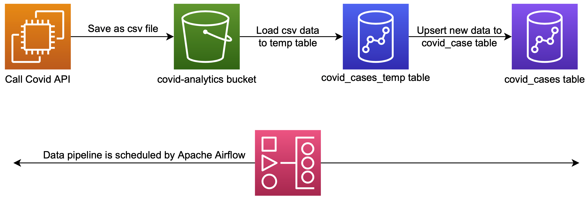
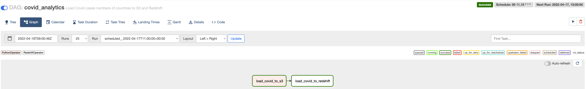
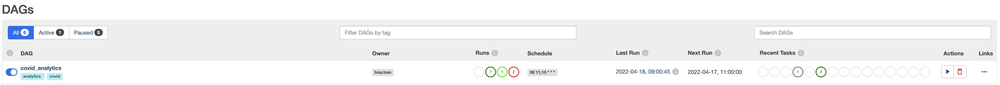
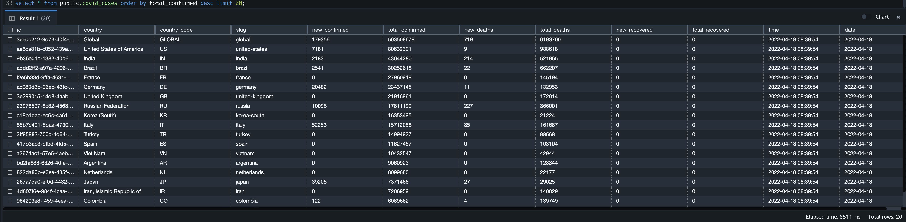

# Covid Analytics

In this repository, we track numbers of Covid19 cases by country and date.



We use this [Covid API][covid-api] to get the numbers, then store these values to Amazon S3 as csv files.

There are some functions related to getting data from the API are written in [corona_api.py](airflow/plugins/libs/corona_api.py) file.

Then the data from S3 is copied to `covid_cases_temp` table in Amazon Redshift data warehouse.

Using the data from the temporary table, we continue to upsert to main `covid_cases` table. Here is an [upsert script](airflow/plugins/sql_queries/load_covid_cases.sql).

The reason that we should do upserting is to avoid the duplication in the Redshift table. The data pipeline could be triggered several times per day, but the data from API is updated daily, and we also need to analyze the daily data, so the pipeline and the main table should be idempotent, which means that the pipelines produces the same result regardless of how many times this is run.

Instead of inserting data directly to Redshift, we store the data first in S3, so we can access this data from different tool such as Athena, Presto, .etc. Beside that, `COPY` command provides a better preformance to copy the data from S3 to Redshift, than inserting records directly to the data warehouse.

## Table schema
The main table `covid_cases` was created with a below structure. Here is a detail [table creation script](airflow/plugins/sql_queries/covid_cases_creation.sql).

Because we want to know the numbers of covid cases by country and date, so the table is distributed by country and sorted by date.

The API updates the values daily so a combination of (country, date) should be unique in our table. 
```sql
CREATE TABLE IF NOT EXISTS public.covid_cases
(
	id VARCHAR(256) NOT NULL  ENCODE lzo
	,country VARCHAR(256) NOT NULL  ENCODE lzo
	,country_code VARCHAR(256)   ENCODE lzo
	,slug VARCHAR(256)   ENCODE lzo
	,new_confirmed INTEGER   ENCODE az64
	,total_confirmed BIGINT   ENCODE az64
	,new_deaths INTEGER   ENCODE az64
	,total_deaths BIGINT   ENCODE az64
	,new_recovered INTEGER   ENCODE az64
	,total_recovered BIGINT   ENCODE az64
	,"time" TIMESTAMP WITHOUT TIME ZONE   ENCODE RAW
	,date DATE NOT NULL  ENCODE RAW
	,UNIQUE (country, date)
)
DISTSTYLE KEY
 DISTKEY (country)
 SORTKEY (
	date
	)
;
```

## Airflow DAG scheduler
Here is a [DAG file](airflow/dags/covid_analytics.py) for the pipeline, which contain 2 tasks: `load_covid_to_s3` and `load_covid_to_redshift`



We can schedule it to run daily or 2 times per day, for example at 11:00 and 15:00 by setting `schedule_interval="00 11,15 * * *"`



## Code deployment
Depend on an infrastructure including Airflow installation, we need to synchronize airflow `dags` and `plugins` folders from our repository to the running Airflow.
We can simply do a CI/CD process through Github Actions like I defined this [github_actions.yml](.github/workflows/github_actions.yml) file, e.g.
```yaml
    - name: Synchronize Airflow dags and plugins to a server
      run: |
        rsync -av --exclude '*__pycache__*' --delete airflow/dags/ ubuntu@${{ env.airflow_ip }}:/home/ubuntu/airflow/dags
        rsync -av --exclude '*__pycache__*' --delete airflow/plugins/ ubuntu@${{ env.airflow_ip }}:/home/ubuntu/airflow/plugins
```

## Table result
After running the data pipeline, when we query `covid_cases` table, result will look like this


## Project development and coding convention
This project is using [Poetry][poetry] for dependency management and packaging.

In order to ensure the quality of the project, we use following libraries:
- black: The uncompromising Python code formatter
- isort: Utility to sort imports alphabetically, and automatically separated into sections and by type
- flake8: Tool for style guide enforcement and code linter
- mypy: Optional static typing for Python
- pydocstyle: Static analysis tool for checking compliance with Python docstring conventions
- pre-commit: A framework for managing and maintaining pre-commit hooks

For more details of the libraries versions, coding convention configuration, please take a look at [pyproject.toml](pyproject.toml) and [.pre-commit-config.yaml](.pre-commit-config.yaml)

I also force the code quality checking by Github Actions e.g.
```yaml
      - name: Code format checking with Black
        run: /home/ubuntu/.virtualenvs/githubenv/bin/black --check .
```


<!-- links -->
[covid-api]: https://documenter.getpostman.com/view/10808728/SzS8rjbc#9739c95f-ef1d-489b-97a9-0a6dfe2f74d8
[poetry]: https://github.com/python-poetry/poetry
